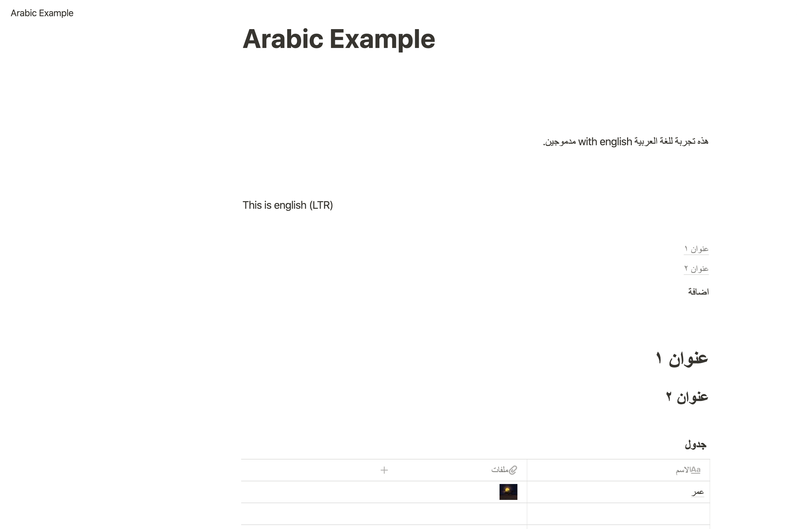

# notion-rtl
<!-- ALL-CONTRIBUTORS-BADGE:START - Do not remove or modify this section -->

<!-- ALL-CONTRIBUTORS-BADGE:END -->

A Chrome extension to enable RTL support in https://notion.so

The extension isn't really doing anything fancy, all it's doing is that it fetches all top-level blocks that
are direct children of `.notion-page-content` that don't have the `dir` attribute, every 200 milliseconds (this part really needs to be optimized, I made it in a hurry, but check out [#2](https://github.com/obahareth/notion-rtl/issues/2) if you're willing to help) 
then it sets `dir="auto"` on those blocks.

## Contributors ✨

Thanks goes to these wonderful people ([emoji key](https://allcontributors.org/docs/en/emoji-key)):

<!-- ALL-CONTRIBUTORS-LIST:START - Do not remove or modify this section -->
<!-- prettier-ignore-start -->
<!-- markdownlint-disable -->
<table>
  <tr>
    <td align="center"><a href="https://mhmd.dev"> <b>Mohamad Bahamdain</b></a> <a href="https://github.com/obahareth/notion-rtl/commits?author=imhmdb" title="Code">💻</a> <a href="#ideas-imhmdb" title="Ideas, Planning, & Feedback">🤔</a> <a href="#platform-imhmdb" title="Packaging/porting to new platform">📦</a></td>
    <td align="center"><a href="https://e7san.gitbook.io/wiki"> <b>Ehsan Zumrut</b></a> <a href="https://github.com/obahareth/notion-rtl/pulls?q=is%3Apr+reviewed-by%3AEhsanZ" title="Reviewed Pull Requests">👀</a></td>
  </tr>
</table>

<!-- markdownlint-enable -->
<!-- prettier-ignore-end -->
<!-- ALL-CONTRIBUTORS-LIST:END -->

This project follows the [all-contributors](https://github.com/all-contributors/all-contributors) specification. Contributions of any kind welcome!